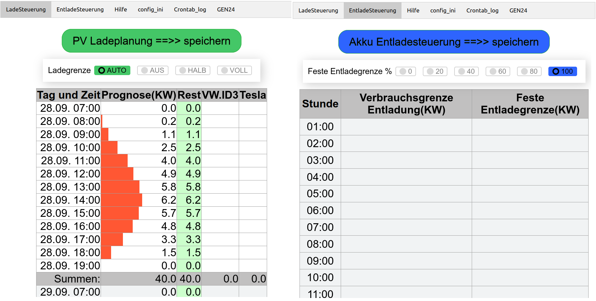

# GEN24_Ladesteuerung 
(getestet unter Python 3.8 und 3.9)

Ladesteuerung für  Fronius Symo GEN24 Plus um die 70% Kappung zu umgehen,
und Produktion über der AC-Ausgangsleistung des WR als DC in die Batterie zu laden.

Das Programm wurde auf Grundlage von https://github.com/godfuture/SymoGen24Weather erstellt.  
Herzlichen Dank an "godfuture"

Voraussetzung ist, dass "Slave als Modbus TCP" am GEN24 aktiv  
und auf "int + SF" gestellt ist, sonst passen die Register nicht.

Folgende Installationen sind nötig, damit die Pythonskripte funktionieren  
(getestet auf einem Ubuntu/Mint und auf einem Raspberry Pi mit Debian GNU/Linux 11)

sudo apt install python3  
sudo apt install python3-pip  
sudo pip install pyModbusTCP==v0.1.10   # mit Version 0.2.x nicht lauffähig  
sudo pip install pickledb  
sudo pip install pytz  
sudo pip install xmltodict  
sudo pip install NumPy==v1.23.1  
sudo pip install requests  
sudo pip install ping3  

Die Startskripte können per Cronjobs gestartet werden.  
Als Erstes muss ein start_WeatherData.. aufgerufen werden, damit Prognosedaten in weatherData.json vorhanden sind!!!

Beispiele Crontabeintraege ("DIR" durch dein Insttallationverzeichnis ersetzen)  
Ausführrechte für die start_...sh skripte setzen nicht vergessen (chmod +x start_*)

*/5 05-20 * * * /DIR/start_LoggingSymoGen24.sh  
*/5 04-20 * * * /DIR/start_SymoGen24Controller2.sh  
33 6,8,10,12,14,16 * * * /DIR/start_WeatherDataProvider2.sh  
8 5,10,15,19 * * * /DIR/start_Solarprognose_WeatherData.py.sh #Minuten und Sekunden (config.ini) anpassen  

#Crontab.log jeden Montag abräumen  
0 5 * * 1 mv /DIR/Crontab.log /DIR/Crontab.log_weg  

WeatherDataProvider2.py

holt die Sonnenstundenprognosen von forecast.solar und schreibt sie in weatherData.json  
Damit die Wetterdaten aktuell bleiben ist es besser sie öfter abzufragen (bei mir alle 2 Std)

Solarprognose_WeatherData.py 

Kann alternativ zu WeatherDataProvider2.py benutzt werden, ist etwas genauer, es ist aber ein Account erforderlich,  
hier wird eine genauer Zeitpunkt für die Anforderung vorgegeben.  
Holt die Sonnenstundenprognosen von solarprognose.de und schreibt sie in weatherData.json  
Damit die Wetterdaten aktuell bleiben ist es besser sie öfter abzufragen (bei mir alle 3 Std)  

SymoGen24Connector.py

Wird von SymoGen24Controller2.py aufgerufen und stellt die Verbindung Zum Wechselrichter (GENR24 Plus) her.

SymoGen24Controller2.py

berechnet die aktuell besten Ladewerte aufgrund der Werte in weatherData.json und der tatsächlichen Einspeisung bzw Produktion und gibt sie aus.
Mit dem Parameter "schreiben" aufgerufen (was in der start_SymoGen24Controller2.sh geschieht) schreibt er die Ladewerte auf den Wechselrichter  
falls Änderungen außerhalb der gesetzten Grenzen sind.

LoggingSymoGen24.py (optional)

schreibt folgende Werte in die Log.csv zur Auswertung der Ergebnisse mit z.B. libreoffice Calc, in folgendem Format:
Zeit,Ladung Akku,Verbrauch Haus,Leistung ins Netz,Produktion,Prognose forecast.solar,Aktuelle Ladegrenze,Batteriestand in Prozent

#####################################################################

Modul zur Reservierung von größeren Mengen PV-Leistung  
=======================================================  
(z.B. E-Autos)

Das Modul ist in PHP programmiert und setzt einen entsprechend konfigurierten Webserver (z.B. Apache, ) voraus.  
Konfiguration muss in der "config.php" angepasst werden. 

Nur zum testen kann der PHPeigene Webserver benutzt werden. Einfach unter /DIR/html/ folgendes aufrufen: 
php -S 0.0.0.0:7777  
Und im Browser localhost:7777 aufrufen. 

Webserver Apache z.B.:

Installation:  
sudo apt install apache2 php  
In /etc/apache2/apache2.conf   
<Directory /srv/> durch <Directory /DIR/html/> ersetzen! 

In /etc/apache2/sites-available/000-default.conf  
DocumentRoot /var/www/html durch DocumentRoot /DIR/html/ ersetzen 

ACHTUNG!! /DIR/ und /DIR/html/ muss Schreibrechte für Apache haben!! 
Mit der Namenskonvention [1-9]_tab_xxxxxxx.[php|html] können eigene Skripts als "Tab" eingebunden werden. 
Vorhandene Module: 
1_tab_LadeSteuerung.php    ==>> Reservierung von großen PV-Mengen und feste manuelle Ladesteuerung 
2_tab_EntladeSteuerung.php ==>>  EntladeSteuerung durch Eintrag in Tabelle und feste manuelle Entladesteuerung 
3_tab_Hilfe.html       ==>> Hile zu Reservierung von großen PV-Mengen 
4_tab_config_ini.php   ==>> Anzeigen und Editieren der config.ini 
5_tab_Crontab_log.php  ==>> Anzeigen der Logdatei Crontab.log 
6_tab_GEN24.php        ==>> lokaler Aufruf des GEN24 

Apache neu starten  
sudo systemctl restart apache2  

Reservierung im Browser aufrufen (= IP oder localen Namen des RasberryPi).

Batterieladesteuerung ( TAB--> LadeSteuerung ) 

Alle eingetragenen Reservierungen werden in die Datei /DIR/Watt_Reservierung.json geschrieben.  
In der html/config.php müssen die Dateipfade und Variablen angepasst werden.   

Ist das Modul eingeschaltet (in /DIR/config.ini -->> PV_Reservierung_steuern = 1) wird die Reservierung  
beim nächsten Aufruf von SymoGen24Controller2.py mit eingerechnet.

Mit einer gewählten Ladestufe (AUS, HALB, VOLL) unter Hausakkuladung wird die entsprechende Batterieladeleistung,
beim nächsten Aufruf von SymoGen24Controller2.py auf den Wechselrichter geschrieben.  
Die prognosebasierte Ladesteuerung ist dadurch deaktivieren, und kann mit der Option "AUTO" wieder aktiviert werden. 

BatterieENTladesteuerung ( TAB--> EntladeSteuerung ) 

Unter "Feste Entladegrenze " kann die maximale Entladeleistung
in den Schritten 0, 20, 40, 60, 80 oder 100 Prozent fest eingestellt werden.

In der Entladetabelle können Leistungen in KW zur Steuerung der Akkuentladung eingetragen werden.

Weitere Erklärungen stehen in der Hilfe (3_tab_Hilfe.html)

