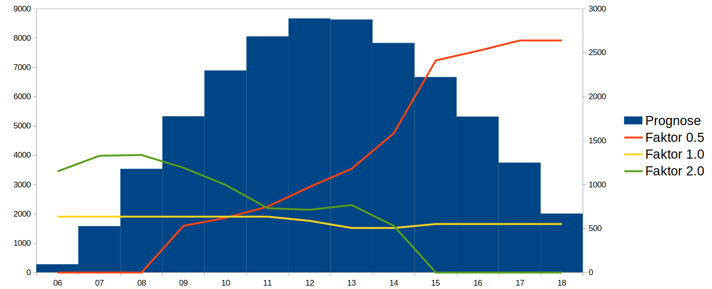
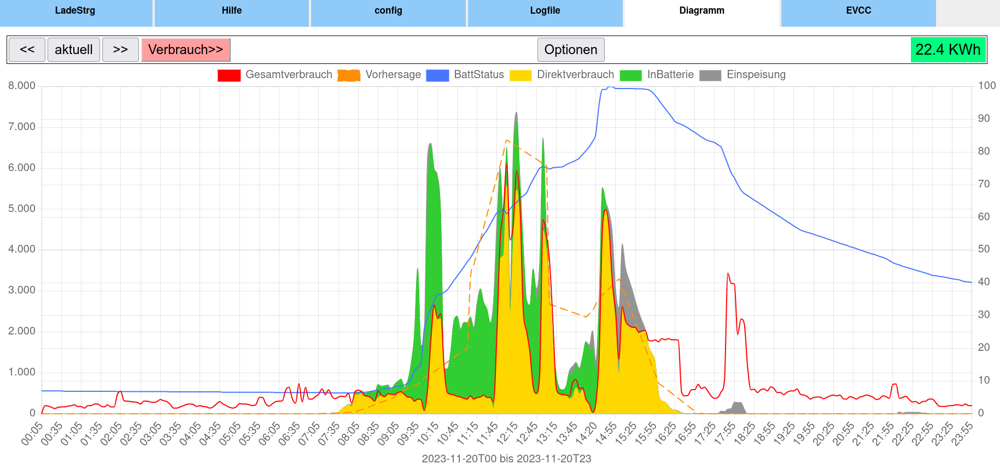
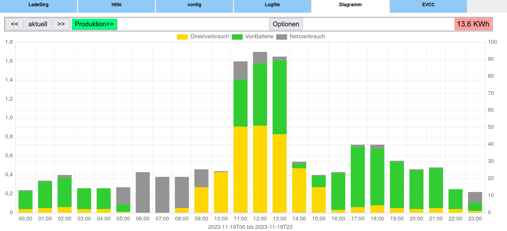
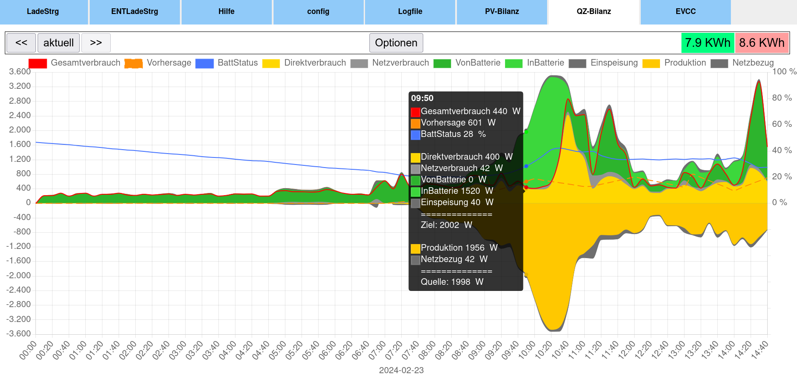
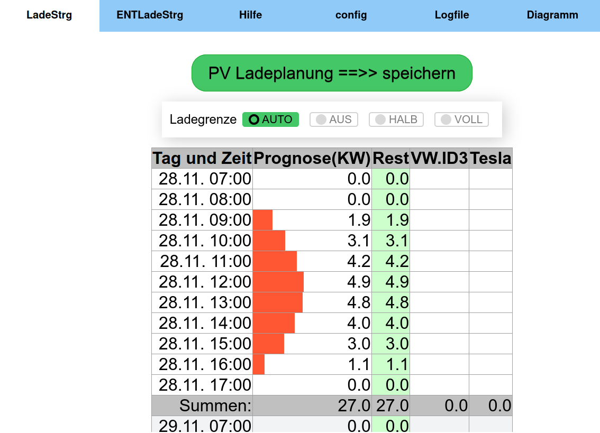
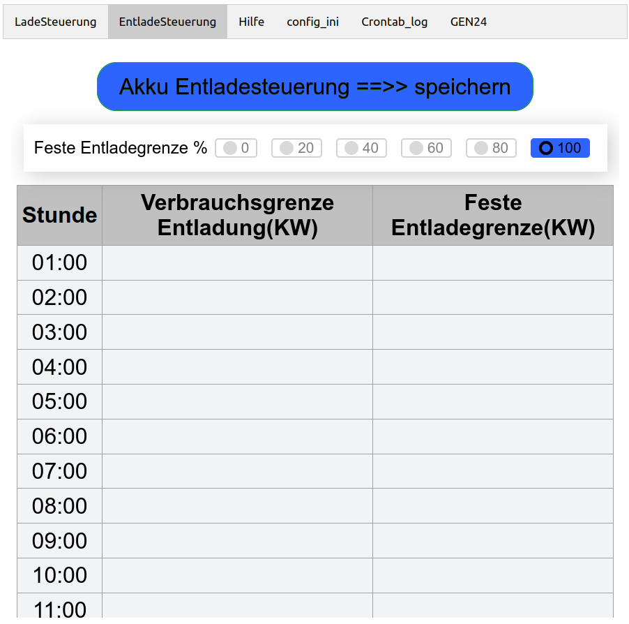

## ☀️ GEN24_Ladesteuerung 🔋 
(getestet unter Python 3.8 und 3.9)  
  
Ab Version: **0.20.0**  
[:chart_with_downwards_trend: http_SymoGen24Controller2.py](https://github.com/wiggal/GEN24_Ladesteuerung/#chart_with_downwards_trend-http_symogen24controller2py) Ladewerte **per HTTP-Request** in das Batteriemanagement schreiben.  
  

- Prognosebasierte Ladesteuerung für  Fronius Symo GEN24 Plus um eine Einspeisebegrenzung (bei mir 70%) zu umgehen,
und eine Produktion über der AC-Ausgangsleistungsgrenze des WR als DC in die Batterie zu laden.  
Über die Tabelle [Ladesteuerung](https://github.com/wiggal/GEN24_Ladesteuerung/#batterieladesteuerung--tab---ladesteuerung-) können große, geplante Verbräuche bei der Ladeplanung berücksichtigt werden.  
- [Entladesteuerung,](https://github.com/wiggal/GEN24_Ladesteuerung/#batterieentladesteuerung--tab---entladesteuerung-) um die Entladung der Batterie bei großen Verbräuchen zu steuern.  
- [Logging](https://github.com/wiggal/GEN24_Ladesteuerung/#bar_chart-logging) und grafische Darstellung von Produktion und Verbrauch.  
- Akkuschonung: Um eine LFP-Akku zu schonen, wird die Ladeleistung ab 80% auf 0,2C und ab 90% auf 0,1C beschränkt.  

Die Ladung des Hausakkus erfolgt prognosebasiert und kann mit der Variablen „BatSparFaktor“ in der „config.ini“ gesteuert werden.  
Hier zwei Grafiken um die Auswirkung des „BatSparFaktor“ zu verdeutlichen:  


## 💾 Installationshinweise: [(siehe auch Wikibeitrag)](https://github.com/wiggal/GEN24_Ladesteuerung/wiki/Installation-GEN24_Ladesteuerung-auf-einem-RaspberryPi)
Bei Verwendung von **SymoGen24Controller2.py** ist Voraussetzung, dass "Slave als Modbus TCP" am GEN24 aktiv 
und auf "int + SF" gestellt ist.  
Bei Verwendung von **http_SymoGen24Controller2.py** wird Modbus nicht benötigt.

Folgende Installationen sind nötig, damit die Pythonskripte funktionieren  
(getestet auf einem Ubuntu/Mint und auf einem Raspberry Pi mit Debian GNU/Linux 11)
```
sudo apt install python3
sudo apt install python3-pip
sudo pip install pyModbusTCP==v0.1.10   # mit Version 0.2.x nicht lauffähig
sudo pip install pickledb
sudo pip install pytz
sudo pip install xmltodict
sudo pip install NumPy==v1.23.1
sudo pip install requests
sudo pip install ping3
```
Mit start_PythonScript.sh können Pythonskripte per Cronjobs oder auf der Shell gestartet werden, die Ausgabe erfolgt dann in die Datei "Crontab.log". 
Als Erstes muss ein Prognoseskript aufgerufen werden, damit neue Prognosedaten in der Datei weatherData.json vorhanden sind!  

Beispiele für Crontabeinträge ("DIR" durch dein Installationsverzeichnis ersetzen)  
Ausführrechte für das start_PythonScript.sh Skript setzen nicht vergessen (chmod +x start_PythonScript.sh)  
SymoGen24Controller2.py bzw. http_SymoGen24Controller2.py durchgehend alle 5 Minuten starten wegen Logging (nur wenn Logging gewünscht). 
(Häufigerer Aufruf nicht sinnvoll, da der Gen24 die Zähler nur alle 5 Minuten aktualisiert!)  

```
1-56/5 * * * * /DIR/start_PythonScript.sh SymoGen24Controller2.py schreiben
```
**ODER!!**
```
1-56/5 * * * * /DIR/start_PythonScript.sh http_SymoGen24Controller2.py schreiben
```
**ACHTUNG:** nur den Wetterdienst eintragen, den ihr verwenden wollt.
```
33 5,8,10,12,14 * * * /DIR/start_PythonScript.sh WeatherDataProvider2.py
8 5,7,9,11,13,15 * * * /DIR/start_PythonScript.sh Solarprognose_WeatherData.py
0 6,8,11,13,15 * * * /DIR/start_PythonScript.sh Solcast_WeatherData.py
```
**Crontab.log jeden Montag abräumen**
```
0 5 * * 1 mv /DIR/Crontab.log /DIR/Crontab.log_weg
```

### :sun_behind_rain_cloud: WeatherDataProvider2.py

holt die Leistungsprognose von forecast.solar und schreibt sie in weatherData.json  
Damit die Wetterdaten aktuell bleiben ist es besser sie öfters am Tag abzurufen (bei mir alle 2-3 Std)

### :sun_behind_rain_cloud: Solarprognose_WeatherData.py 

Kann alternativ zu WeatherDataProvider2.py benutzt werden, ist etwas genauer, es ist aber ein Account erforderlich,
hier wird eine genauer Zeitpunkt für die Anforderung vorgegeben.  
Holt die Leistungsprognose von solarprognose.de und schreibt sie in weatherData.json.
Damit die Wetterdaten aktuell bleiben ist es besser sie öfter abzufragen (bei mir alle 2-3 Std)  

### :sun_behind_rain_cloud: Solcast_WeatherData.py

Kann auch alternativ zu WeatherDataProvider2.py benutzt werden, es ist ein "Home User" Account auf solcast.com erforderlich.  
Holt die Leistungsprognose von toolkit.solcast.com.au und schreibt sie in weatherData.json.
Leider kann Solcast_WeatherData.py nur 5x am Tag aufgerufen werden, da pro Lauf zwei Zugriffe erforderlich sind (10 pro Tag).  

### :chart_with_upwards_trend: SymoGen24Controller2.py

berechnet den aktuell besten Ladewert aufgrund der Prognosewerte in weatherData.json, dem Akkustand und der tatsächlichen Einspeisung bzw. Produktion und gibt sie aus.
Ist die Einspeisung über der Einspeisebegrenzung bzw. die Produktion über der AC-Kapazität der Wechselrichters, wird dies in der Ladewerteberechnung berücksichtigt.  
Mit dem Parameter "schreiben" aufgerufen (start_PythonScript.sh SymoGen24Controller2.py **schreiben**) schreibt er die Ladewerte **per Modbus** auf den Wechselrichter, 
falls die Änderung über der gesetzten Grenze ist.

### FUNCTIONS/SymoGen24Connector.py
Wird von SymoGen24Controller2.py aufgerufen und stellt die Verbindung **per Modbus** zum Wechselrichter (GEN24 Plus) her.

### :chart_with_downwards_trend: http_SymoGen24Controller2.py

berechnet den aktuell besten Ladewert aufgrund der Prognosewerte in weatherData.json und dem Akkustand und gibt sie aus. 
Ist die Produktion über der AC-Kapazität der Wechselrichters, wird dies in der Ladewerteberechnung berücksichtigt. 
Mit dem Parameter "schreiben" aufgerufen (start_PythonScript.sh http_SymoGen24Controller2.py **schreiben**) schreibt er die Ladewerte **per HTTP-Request** 
in das Batteriemanagement des Wechselrichter, falls die Änderung über der gesetzten Grenze ist.
Die **Einspeisung** muss hier nicht berücksichtigt werden, da dies das Batteriemanagement selbst regelt (auch über der definierten Ladegrenze!)

## Hinweise ab hier nur für GUI erforderlich (optional):
Die prognosebasierte Ladesteuerung funktioniert auch ohne GUI (Webserver).  

### :bar_chart: Logging

Wenn in der "config.ini" Logging_ein = 1 gesetzt ist, werden die Werte im "Logging_file" im sqlite-Format gespeichert.  
Beim Aufruf von `SymoGen24Controller2.py schreiben` oder `http_SymoGen24Controller2.py schreiben` wird die Ladesteuerung und das Logging ausgeführt. 
Beim Aufruf mit dem Parameter ` logging` wird nur das Logging ausgeführt, es erfolgt keine Ladesteuerung.  
Aus der SQLite-Datei werden dann in html/7_tab_Diagram.php Diagramme erzeugt.  
Hier z.B. das Liniendiagramm zur Tagesproduktion:  

oder das Balkendiagramm zum Tagesverbrauch:  


html/8_tab_Diagram.php erzeugt ein Diagramm nach Quelle (wo kommt die Energie her) und Ziel (wo geht die Energie hin).  
Dadurch soll z.B. ein Laden der Batterie aus dem Netz ersichtlich bzw. gezählt werden.  


#####################################################################

## Modul zur Reservierung von größeren Mengen PV-Leistung, manuelle Ladesteuerung bzw. Entladesteuerung
(z.B. E-Autos)

Das Modul ist in PHP programmiert und setzt einen entsprechend konfigurierten Webserver (z.B. Apache, ) voraus.  
Konfiguration muss eventuell in der "config.php" angepasst werden.  

Nur zum testen kann der PHPeigene Webserver benutzt werden (PHP muss installiert sein, siehe unten). Einfach unter /DIR/html/ folgendes starten:  
```
php -S 0.0.0.0:7777 

# oder damit der Webserver im Hintergrund weiterläuft

nohup php -S 0.0.0.0:7777 &
```
Und im Browser localhost:7777 bzw. raspberrypi:7777 aufrufen.  

Webserver Apache z.B.:

### :floppy_disk: Installationshinweise: [(siehe auch Wikibeitrag)](https://github.com/wiggal/GEN24_Ladesteuerung/wiki/Installation-GEN24_Ladesteuerung-auf-einem-RaspberryPi)
```
sudo apt install apache2 php
sudo apt install php-sqlite3
```
In /etc/apache2/apache2.conf   
<Directory /srv/> durch <Directory /DIR/html/> ersetzen!  

In /etc/apache2/sites-available/000-default.conf  
DocumentRoot /var/www/html durch DocumentRoot /DIR/html/ ersetzen  

Apache neu starten  
sudo systemctl restart apache2  
Reservierung im Browser aufrufen (= IP oder localen Namen des RasberryPi).

ACHTUNG!! /DIR/ und /DIR/html/ muss Schreibrechte für den Webserver Apache haben!!  
Vorschlag:  
Den Apachewebserver unter demselben USER laufen lassen, unter dem man arbeitet bzw. auch die Crojobs laufen.
In der Datei `/etc/apache2/envvars` die Variablen `APACHE_RUN_USER` und `APACHE_RUN_GROUP` anpassen.  

Vorhandene Skripts:  
1_tab_LadeSteuerung.php    ==>> Reservierung von großen PV-Mengen und feste manuelle Ladesteuerung  
2_tab_EntladeSteuerung.php ==>>  EntladeSteuerung durch Eintrag in Tabelle und feste manuelle Entladesteuerung  
3_tab_Hilfe.html       ==>> Hile zu Reservierung von großen PV-Mengen  
4_tab_config_ini.php   ==>> Anzeigen und Editieren der config.ini  
5_tab_Crontab_log.php  ==>> Anzeigen der Logdatei Crontab.log  
6_tab_GEN24.php        ==>> lokaler Aufruf des GEN24  
7_tab_Diagram.php      ==>> Diagramme über Produktion und Verbrauch  

Mit der Namenskonvention [1-9]_tab_xxxxxxx.[php|html] können eigene Skripts als "Tab" eingebunden werden.  


### Batterieladesteuerung ( TAB--> LadeSteuerung )


Alle eingetragenen Reservierungen werden in die Datei /DIR/Watt_Reservierung.json geschrieben.  
In der html/config.php können die Variablen angepasst werden (z.B. $PV_Leistung_KWp) .   

Ist das Modul eingeschaltet (in /DIR/config.ini -->> PV_Reservierung_steuern = 1) wird die Reservierung  
beim nächsten Aufruf von SymoGen24Controller2.py in der Ladeberechnung berücksichtigt.

Mit einer gewählten Ladestufe (AUS, HALB, VOLL) unter Hausakkuladung wird die entsprechende Batterieladeleistung,
beim nächsten Aufruf von SymoGen24Controller2.py auf den Wechselrichter geschrieben.  
Die prognosebasierte Ladesteuerung ist dadurch deaktivieren, und kann mit der Option "AUTO" wieder aktiviert werden.  

Weitere Erklärungen stehen im Hilfetab 3_tab_Hilfe.html [Vorschau hier](pics/3_tab_Hilfe.pdf)

### BatterieENTladesteuerung ( TAB--> EntladeSteuerung )


Unter "Feste Entladegrenze " kann die maximale Entladeleistung
in den Schritten 0, 20, 40, 60, 80 oder 100 Prozent fest eingestellt werden.

In der Entladetabelle können Leistungen in KW zur Steuerung der Akkuentladung eingetragen werden.

Weitere Erklärungen stehen im Hilfetab 3_tab_Hilfe.html [Vorschau hier](pics/3_tab_Hilfe.pdf)

=======================================================  
Das Programm wurde auf Grundlage von https://github.com/godfuture/SymoGen24Weather erstellt.  
Herzlichen Dank an "godfuture"

