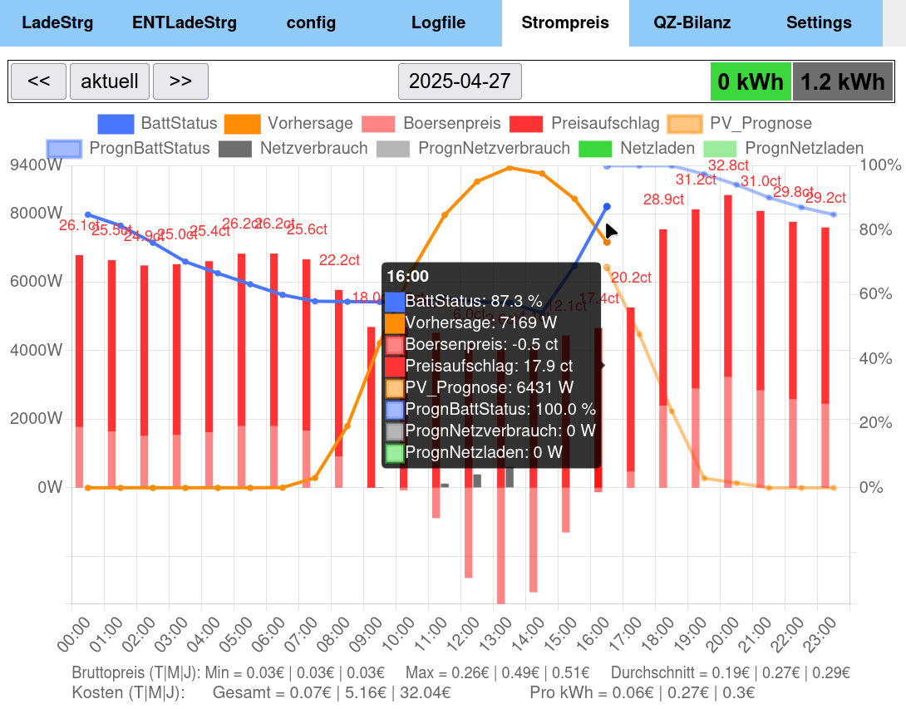
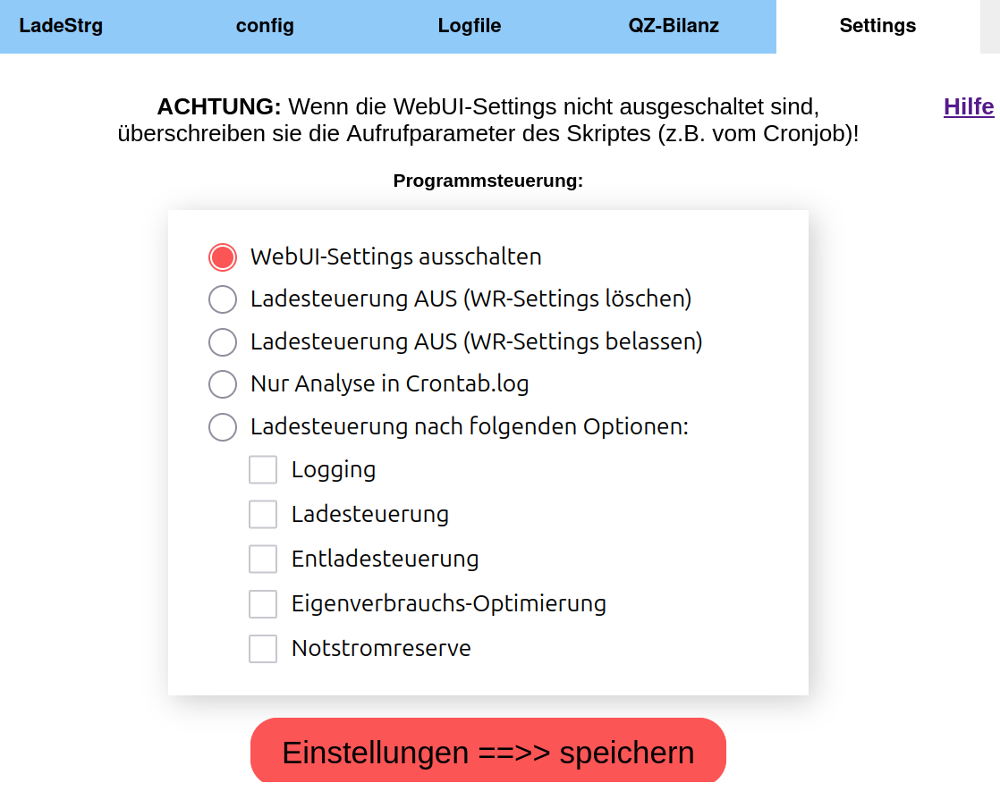

## ☀️ GEN24_Ladesteuerung 🔋 
(getestet unter Python 3.8 und 3.9)  
  
Ab Version: **0.26.1**  
Dynamischer Strompreis: Akku laden bei günstigen Strompreisen in Tabelle ENTLadeStrg eintragen durch DynamicPriceCheck.py.  
Ab Version: **0.25.1**  
Prognosebegrenzung auf Höchstwerte der historischen Produktion.  
Ab Version: **0.25.0**  
Zwangsladung durch Eintragen von negativen kW in die Tabelle ENTLadeStrg  
  

- Prognosebasierte Ladesteuerung für  Fronius Symo GEN24 Plus um eine Einspeisebegrenzung (bei mir 70%) zu umgehen,
und eine Produktion über der AC-Ausgangsleistungsgrenze des WR als DC in die Batterie zu laden.  
Über die Tabelle [Ladesteuerung](https://github.com/wiggal/GEN24_Ladesteuerung/#batterieladesteuerung--tab---ladesteuerung-) können große, geplante Verbräuche bei der Ladeplanung berücksichtigt werden.  
- [Entladesteuerung,](https://github.com/wiggal/GEN24_Ladesteuerung/#batterieentladesteuerung--tab---entladesteuerung-) um die Entladung der Batterie bei großen Verbräuchen zu steuern.  
- [Logging](https://github.com/wiggal/GEN24_Ladesteuerung/#bar_chart-logging) und grafische Darstellung von Produktion und Verbrauch.  
- Akkuschonung: Um einen LFP-Akku zu schonen, wird die Ladeleistung ab 80% auf 0,2C und ab 90% auf 0,1C (optional ab 95% weniger) beschränkt (anpassbar).  
- [Dynamischen Strompreis](https://github.com/wiggal/GEN24_Ladesteuerung/#heavy_dollar_signelectric_plug-dynamicpricecheckpy) nutzen um bei niedrigen Preisen den Akku zu laden.  

Die Ladung des Hausakkus erfolgt prognosebasiert und kann mit der Variablen „BatSparFaktor“ in der „CONFIG/charge_priv.ini“ gesteuert werden.  
Hier eine schematische Darstellung um die Auswirkung des „BatSparFaktor“ zu verdeutlichen:  


## 💾 Installationshinweise: [(siehe Wikibeitrag)](https://github.com/wiggal/GEN24_Ladesteuerung/wiki/1\)-Installation-GEN24_Ladesteuerung-auf-einem-RaspberryPi)

Folgende Installationen sind nötig, damit die Pythonskripte funktionieren  
```
sudo apt install python3
sudo apt install python3-pip
sudo pip install pytz
sudo pip install requests
sudo pip install numpy
sudo pip install pandas
sudo pip install scikit-learn
```
Mit start_PythonScript.sh können Pythonskripte per Cronjobs oder auf der Shell gestartet werden, die Ausgabe erfolgt dann in die Datei "Crontab.log". 
Als Erstes muss ein Prognoseskript aufgerufen werden, damit aktuelle Prognosedaten in der Datei weatherData.json vorhanden sind!  

Beispiele für Crontabeinträge ("DIR" durch dein Installationsverzeichnis ersetzen).  
Ausführrechte für das start_PythonScript.sh Skript setzen nicht vergessen (chmod +x start_PythonScript.sh).  
http_SymoGen24Controller2.py durchgehend (wegen Logging) alle 10 Minuten starten  
(Häufigerer Aufruf für Logging nicht sinnvoll, da der Gen24 die Zähler nur alle 5 Minuten aktualisiert!).  
Da bei der HTTP-Methode der WR die Einspeisebegrenzung regelt, reicht hier auch ein Aufruf alle 10 Minuten (1-59/10).  

```
1-59/10 * * * * /DIR/start_PythonScript.sh http_SymoGen24Controller2.py schreiben
```
**ACHTUNG:** nur den Wetterdienst eintragen, den ihr verwenden wollt.
```
33 5,8,10,12,14 * * * /DIR/start_PythonScript.sh WeatherDataProvider2.py
8 5,7,9,11,13,15 * * * /DIR/start_PythonScript.sh Solarprognose_WeatherData.py
0 6,8,11,13,15 * * * /DIR/start_PythonScript.sh Solcast_WeatherData.py
```
**Crontab.log jeden Montag abräumen**
```
0 0 * * 1 mv /DIR/Crontab.log /DIR/Crontab.log_weg
```

### :sun_behind_rain_cloud: WeatherDataProvider2.py

Holt die Leistungsprognose von forecast.solar und schreibt sie in weatherData.json  
Damit die Wetterdaten aktuell bleiben ist es besser sie öfters am Tag abzurufen (bei mir alle 2-3 Std)

### :sun_behind_rain_cloud: Solarprognose_WeatherData.py 

Holt die Leistungsprognose von solarprognose.de und schreibt sie in weatherData.json. Es ist aber ein Account erforderlich,
hier wird eine genauer Zeitpunkt für die Anforderung vorgegeben.  
Damit die Wetterdaten aktuell bleiben ist es besser sie öfter abzufragen (bei mir alle 2-3 Std)  

### :sun_behind_rain_cloud: Solcast_WeatherData.py

Holt die Leistungsprognose von toolkit.solcast.com.au und schreibt sie in weatherData.json. Es ist ein "Home User" Account auf solcast.com erforderlich.  
Leider kann Solcast_WeatherData.py nur 5x am Tag aufgerufen werden, da pro Lauf zwei Zugriffe erforderlich sind (10 pro Tag).  

### :chart_with_downwards_trend: http_SymoGen24Controller2.py

Berechnet den aktuell besten Ladewert aufgrund der Prognosewerte in weatherData.json und dem Akkustand und gibt sie aus. 
Mit dem Parameter "schreiben" aufgerufen (start_PythonScript.sh http_SymoGen24Controller2.py **schreiben**) setzt es die `Maximale Ladeleistung` **per HTTP-Request** 
im Batteriemanagement des Wechselrichters. 
Die **Einspeisebegrenzung** und die **AC-Kapazität der Wechselrichters** muss hier nicht berücksichtigt werden,
da dies das Batteriemanagement des GEN24 selber regelt (auch über der definierten `Maximale Ladeleistung`!)

### :heavy_dollar_sign::electric_plug: DynamicPriceCheck.py
Es werden die günstigsten Stunden zum Laden des Akkus aus dem Netz, bzw. eines Akku Entladestopps ermittelt (siehe schematische Darstellung). Der Aufruf von DynamicPriceCheck.py sollte einmal stündlich am besten zwei Minuten vor der vollen Stunde erfolgen.  
**Crontab Beispiel** (-o = alternatives Logfile):
```
58 * * * * /DIR/start_PythonScript.sh -o LOG_DynamicPriceCheck.log DynamicPriceCheck.py schreiben
```
Die Werte werden in die Tabelle EntladeSteuerung eingetragen, und beim nächsten Aufruf von http_SymoGen24Controller2.py auf den GEN24 geschrieben (siehe kleine Bild):


## Webserver Installation (WebUI):  
Nicht zwingend erforderlich, die prognosebasierte Ladesteuerung funktioniert auch ohne WebUI (Webserver)  

**PHP installieren:**
```
sudo apt update && sudo apt upgrade
sudo apt install php php-sqlite3
```
Wenn PHP installiert ist, kann durch die Variable `Einfacher_PHP_Webserver = 1` in der CONFIG/default_priv.ini beim nächsten Start von `start_PythonScript.sh`
automatisch der einfache PHP-Webserver gestartet werden. Die Webseite ist dann auf Port:2424 erreichbar (z.B.: raspberrypi:2424).  

**_Alternativ kann auch der Webserver Apache installiert werden:_**  
[(siehe Wikibeitrag)](https://github.com/wiggal/GEN24_Ladesteuerung/wiki/1\)-Installation-GEN24_Ladesteuerung-auf-einem-RaspberryPi)

### :bar_chart: Logging

Wenn in der "CONFIG/default_priv.ini" Logging_ein = 1 gesetzt ist, werden die Werte im "Logging_file" im sqlite-Format gespeichert.  
Beim Aufruf von `http_SymoGen24Controller2.py schreiben` wird die Ladesteuerung und das Logging ausgeführt. 
Beim Aufruf mit dem Parameter `logging` wird nur das Logging ausgeführt, es erfolgt keine Ladesteuerung.  
Aus der SQLite-Datei werden dann in html/7_tab_Diagram.php Diagramme erzeugt.  
Hier z.B. das Liniendiagramm zur Tagesproduktion:  

oder das Balkendiagramm zum Tagesverbrauch:  


html/8_tab_Diagram.php erzeugt ein Diagramm nach Quelle (wo kommt die Energie her) und Ziel (wo geht die Energie hin). 
Dadurch soll z.B. ein Laden der Batterie aus dem Netz ersichtlich bzw. gezählt werden.  


## Modul zur Reservierung von größeren Mengen PV-Leistung, manuelle Ladesteuerung bzw. Entladesteuerung (z.B. E-Autos)

### Batterieladesteuerung ( TAB--> LadeSteuerung )


Alle eingetragenen Reservierungen werden in die DB-Datei CONFIG/Prog_Steuerung.sqlite geschrieben.  

Ist das Modul eingeschaltet (in CONFIG/charge_priv.ini -->> PV_Reservierung_steuern = 1) wird die Reservierung 
beim nächsten Aufruf von http_SymoGen24Controller2.py in der Ladeberechnung berücksichtigt.

Ist nicht AUTO gewählt, erfolgt eine Batterieladung mit der eingestellten Prozentzahl der **maximalen Ladeleisung des GEN24**,
ab dem nächsten Aufruf von http_SymoGen24Controller2.py.  
Die prognosebasierte Ladesteuerung ist dadurch deaktiviert, und kann mit der Option "AUTO" wieder aktiviert werden.  

Weitere Erklärungen stehen in der verlinkten Hilfe oder im Wiki.  

### BatterieENTladesteuerung ( TAB--> EntladeSteuerung )


Unter "Feste Entladegrenze" kann die maximale Entladeleistung in Prozent der WR-Entladeleistung fest eingestellt werden.

In der Entladetabelle können Leistungen in kW zur Steuerung der Akkuentladung, bzw. zum Laden des Akkus aus dem Netz bei niedrigen Strompreisen, eingetragen werden. 
Durch einen negativen Wert in "Feste Entladegrenze" erfolgt die Zwangsladung des Akkus.

Weitere Erklärungen stehen in der verlinkten Hilfe oder im Wiki.  

### Settings ( TAB--> Settings )


Unter Settings kann das Programm zusätzlich gesteuert werden.  

Weitere Erklärungen stehen in der verlinkten Hilfe oder im Wiki.    

----------

**News History:**  
Ab Version: **0.24.8**  
Werte für Akkuschonung frei konfigurierbar.  
Ab Version: **0.24.5**  
Notstrom Reserverkapazität (Entladebegrenzung) höher setzen, wenn schlechte Prognose morgen.   
Netzdienliches Laden durch Prognosekappung, wenn BatSparFaktor = 0.  
Ab Version: **0.24.4**  
Auslagerung der jahreszeitenabhängingen Konfiguration in zusätzliche config-files.  
Änderung in der CONFIG/charge.ini und charge_priv.ini, neuen Block [monats_priv.ini] eingefügt, usw.  
Ab Version: **0.24.1**  
Einbindung von Fronius-Symos.  
Änderung in der CONFIG/default.ini `IP_weitere_Symo = no` in CONFIG/default_priv.ini einfügen.  
Ab Version: **0.24.0**  
Alle Daten aus den Steuerungs.json Dateien in SQLite-Datenbankdatei CONFIG/Prog_Steuerung.sqlite abgelegt.
Änderungen in WebUI: Reiter Settings neu konzipiert, Schieberegler bei den Prozentangaben der Ladesteuerungen.  
Ab Version: **0.22.0**  
Die config.ini ins Verzeichnis CONFIG verschoben und aufgeteilt auf `default.ini, charge.ini weather.ini`.
Zur jeweiligen `xy.ini` kann eine `xy_priv.ini` mit den persönlichen Anpassungen erstellt werden.  
Ab Version: **0.21.4**  
BattVollUm als Delta der ersten Prognosestunde, die kleiner als 1 % der maximalen PV-Leistung ist.  
Ab Version: **0.21.3**  
In der HTTP-Version kann nun im Energiemanagement, ein Einspeisezielwert der Eigenverbrauchs-Optimierung automatisch geschrieben werden.  
Ab Version: **0.21.2**  
Bei aktivierter EntladeSteuerung auch die `Maximale Entladeleistung` **per HTTP-Request** im Batteriemanagement setzen.  
Ab Version: **0.21.1**  
Zur Ermittlung der gesamten Produktion können auch mehrere GEN24 eingebunden werden.  
Ab Version: **0.20**  
[:chart_with_downwards_trend: http_SymoGen24Controller2.py](https://github.com/wiggal/GEN24_Ladesteuerung/#chart_with_downwards_trend-http_symogen24controller2py) `Maximale Ladeleistung` **per HTTP-Request** im Batteriemanagement setzen.  
