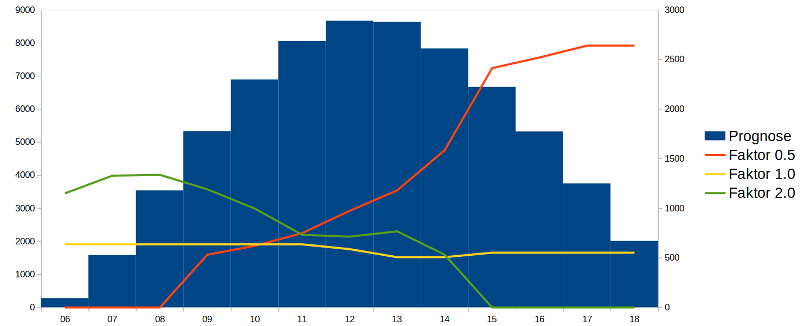
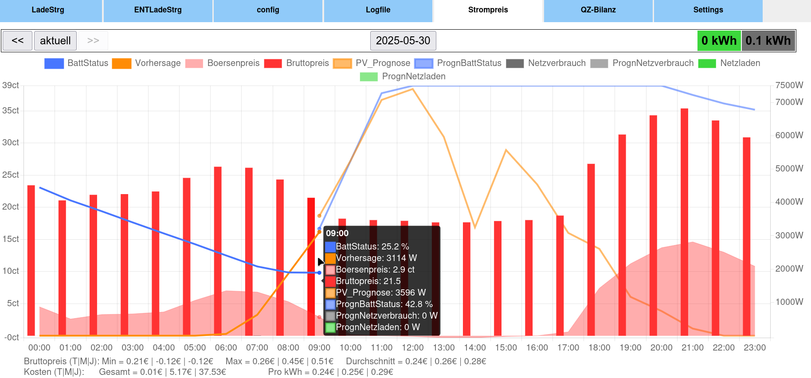
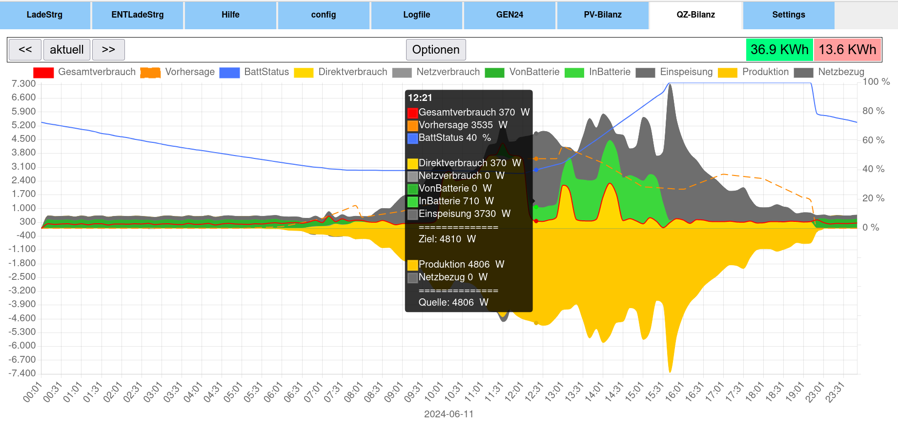
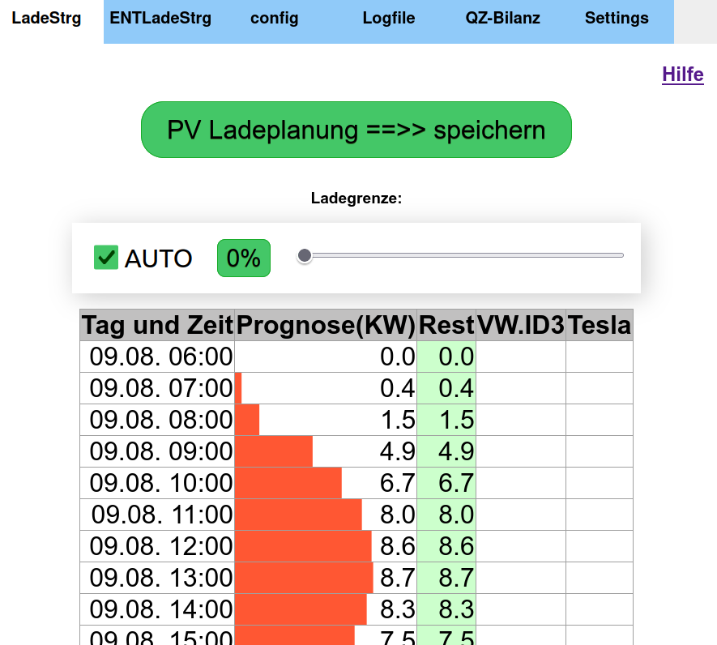
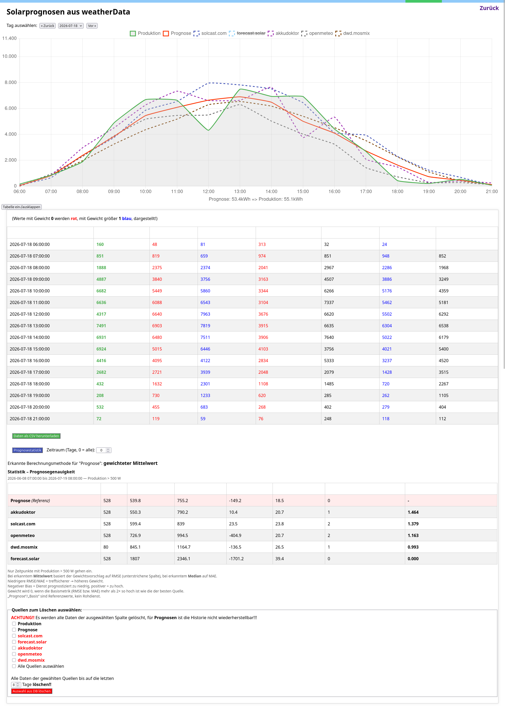
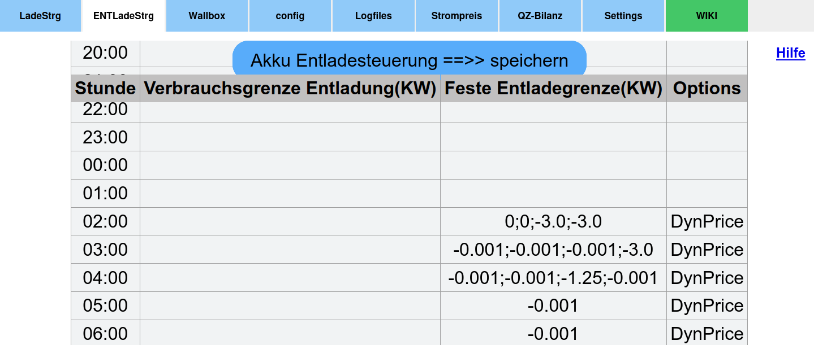
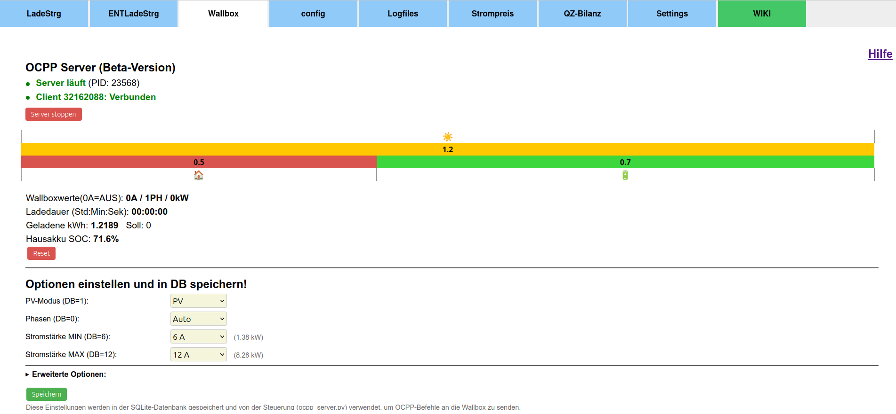
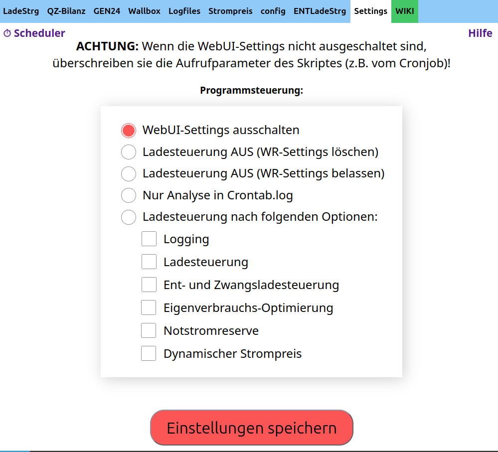
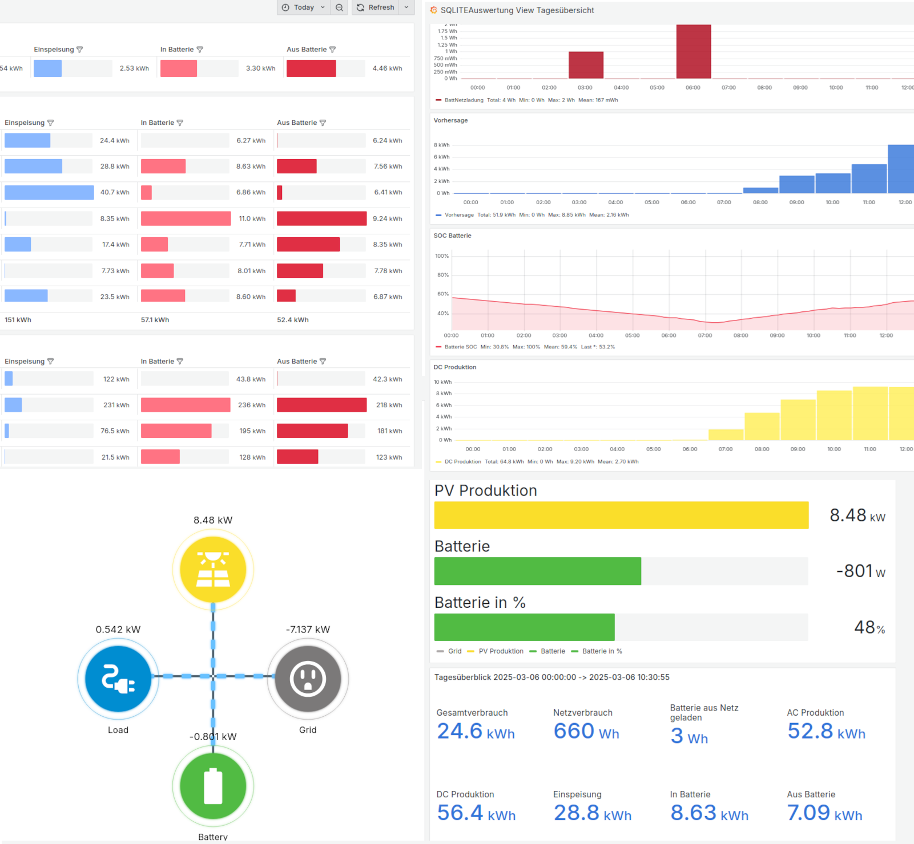

## ⚡☀️ EnergyWIGGAL🔋🚘
## [📚 Wiki 📚](https://wiggal.github.io/GEN24_Ladesteuerung/)

**Programmfunktionen:**  
- Prognose basierte Ladesteuerung für Fronius Symo GEN24 Plus und Verto, um eine Einspeisebegrenzung (bei mir 70%) zu umgehen und den Akku schonend zu laden.
- Über die Tabelle [Ladesteuerung](#batterieladesteuerung) können große, geplante Verbräuche bei der Ladeplanung berücksichtigt werden und Ladeleistungen manuell eingestellt werden.
- Über die Tabelle [Entladesteuerung,](#batterieentladesteuerung)kann die Entladung bzw. Zwangsladung des Akkus gesteuert werden. Auch automatisch mit dynamischen Strompreisen.
- [Logging](#-logging) und grafische Darstellung von Prognoseberechnung, Strompreise und QZ-Bilanz (Produktion und Verbrauch).
- Akkuschonung: Um einen LFP-Akku zu schonen, kann die Ladeleistung z.B. ab 80% auf 0,2C und ab 90% auf 0,1C beschränkt werden. Es ist auch eine Reduzierung der Ladeleistung in Abhängigkeit der höchsten Zellspannung möglich.  
- [Dynamischen Strompreis](#-dynamicpricecheckpy) nutzen um bei niedrigen Preisen den Akku zu laden, mit grafischer Darstellung.  
- [Ladesteuerung des Wattpiloten](#-wallboxsteuerung), für E-Autos 🚘 über OCPP.
- [Grafana](#grafana-beispiele) Beschreibung zu Auswertungen mit Grafana inklusive fertige Dashboards von [@Manniene](https://github.com/Manniene).  
- [Home Assistant Add-on](https://github.com/roethigj/ha_addons/tree/main/gen24_ladesteuerung) erstellt von [@roethigj](https://github.com/roethigj).  

  
Ab Version: **0.42.0**  
- 🚘 Steuerung des Wattpiloten, nun auch mit NextTrip.  

Ab Version: **0.41.7**  
- Es ist nun auch eine Reduzierung der Ladeleistung in Abhängigkeit der höchsten Zellspannung möglich.  

Ab Version: **0.41.0**  
- 🚘 Steuerung des Wattpiloten, über OCPP.  

Ab Version: **0.40.2**  
- 🔄 Updatefunktion im TAB `config`, wenn das Quellverzeichnis ein Git-Repository ist.  

Ab Version: **0.40.0**  
- Programm von GEN24 auf Generic Inverter angepasst, um später auch andere Inverter steuern zu können.  
Es ändert sich der Skriptname `http_SymoGen24Controller2.py` in `EnergyController.py`.  
⚠️ Die **Cronjobs** und die **default_priv.ini** müssen angepasst werden!!  
- [WikiExtension_Gen24_Ladesteuerung von @killwack](https://github.com/killwack/WikiExtension_Gen24_Ladesteuerung/wiki)  

  

Die Ladung des Hausakkus erfolgt prognosebasiert und kann mit der Variablen „BatSparFaktor“ in der „CONFIG/charge_priv.ini“ gesteuert werden.  
Hier eine schematische Darstellung um die Auswirkung des „BatSparFaktor“ zu verdeutlichen:  


## 💾 Installationshinweise: [siehe Wiki](https://wiggal.github.io/GEN24_Ladesteuerung/)

Die Installation bzw. das Update kann mit dem Sktript install_gen24.sh nach dessen Download automatisch durchgeführt werden. 
Für eine manuelle Installation, bzw. genauere Installationshinweise im [Wiki](https://wiggal.github.io/GEN24_Ladesteuerung/).   

### 🌦️ Prognoseskripte in FORECAST

Holen von den jeweiligen API-Urls die Prognosedaten, bereiten sie auf für EnergyController24, und speichern Mittelwerte in weatherData.sqlite. 

Besonderheiten:
- Bei forecast.solar kann mit einem Account die Prognose mit den Werten der Produktion aus der DB angepasst werden.  
- Bei solarprognose.de ist ein Account erforderlich, hier wird ein genauer Zeitpunkt für die Anforderung vorgegeben.  
- Bei solcast.com.au ist ein "Home User" Account erforderlich. Leider kann nur 10x am Tag angefordert werden.  
- Bei api.akkudoktor.net können Abschattungen und weitere Parameter angegeben werden.  
- Bei open-meteo.com können verschiedene Wetterdienste konfiguriert werden, kein Account nötig.  

### 📉 EnergyController.py

Berechnet den aktuell besten Ladewert aufgrund der Prognose in weatherData.sqlite und dem Akkustand und gibt sie aus. 
Mit dem Parameter "schreiben" aufgerufen (start_PythonScript.sh EnergyController.py **schreiben**) setzt es die `Maximale Ladeleistung` **per HTTP-Request** 
im Batteriemanagement des Wechselrichters. 
Die **Einspeisebegrenzung** und die **AC-Kapazität der Wechselrichters** muss hier nicht berücksichtigt werden,
da dies das Batteriemanagement des GEN24 selber regelt (auch über der definierten `Maximale Ladeleistung`!)

### 💲🔌 DynamicPriceCheck.py
Es werden die günstigsten Stunden zum Laden des Akkus aus dem Netz, bzw. eines Akku Entladestopps ermittelt. Der Aufruf von DynamicPriceCheck.py sollte einmal stündlich am besten zwei Minuten vor der vollen Stunde erfolgen.  
**Crontab Beispiel** (-o = alternatives Logfile):
```
58 * * * * /DIR/start_PythonScript.sh -o DynPriceCheck.log DynamicPriceCheck.py schreiben
```
Die Werte werden in die Tabelle EntladeSteuerung eingetragen, und beim nächsten Aufruf von EnergyController.py auf den GEN24 geschrieben.  
Hier das Diagramm zu den dynamischen Strompreisen:

*Einzelne Linien und Balken im Diagramm können durch Anklicken des entsprechenden Legendeneintrags ein- oder ausgeblendet werden.* 

## Webserver Installation (WebUI):  

**PHP installieren:**
```
sudo apt update && sudo apt upgrade
sudo apt install php php-sqlite3
```
Wenn PHP installiert ist, wird durch die Variable `Einfacher_PHP_Webserver = 1` (Standard) in der CONFIG/default_priv.ini beim nächsten Aufruf von `start_PythonScript.sh`
automatisch der einfache PHP-Webserver gestartet werden. Die Webseite ist dann auf Port: 2424 erreichbar (z.B.: raspberrypi:2424).  

**_Alternativ kann auch der Webserver Apache installiert werden:_**  
[siehe Wiki](https://wiggal.github.io/GEN24_Ladesteuerung/)

### 📊 Logging

Beim Aufruf von `EnergyController.py schreiben` wird die Ladesteuerung und das Logging ausgeführt. 
Beim Aufruf mit dem Parameter `logging` wird nur das Logging ausgeführt, es erfolgt keine Ladesteuerung. 
Beim `logging` werden Zählerstände und ermittelte Werte in die SQLite-Datei `PV_Daten.sqlite` gespeichert, 
aus der wird dann durch html/8_tab_Diagram.php das Diagramm **QZ**-Bilanz nach **Q**uelle (wo kommt die Energie her) und **Z**iel (wo geht die Energie hin) erzeugt. 

*Einzelne Linien und Balken im Diagramm können durch Anklicken des entsprechenden Legendeneintrags ein- oder ausgeblendet werden.*

### Batterieladesteuerung



Modul zur Reservierung von größeren Mengen PV-Leistung (z.B. E-Autos) und manuelle Ladesteuerung.   
Alle eingetragenen Reservierungen werden in die DB-Datei CONFIG/Prog_Steuerung.sqlite geschrieben.  

Ist **AUTO** eingestellt, wird die Reservierung von EnergyController.py in der Ladeberechnung berücksichtigt.
Bei Einstellung **Slider**, wird mit der eingestellten Prozentzahl der **maximalen Ladeleistung des GEN24**,  
bei **MaxLadung** mit der in CONFIG/charge_priv.ini unter MaxLadung definierten Ladeleistung,  
ab dem nächsten Aufruf von EnergyController.py geladen.  
Beim Speichern werden nach Auswahl von **Slider** oder **MaxLadung** Gültigkeitsstunden abgefragt, nach deren Ablauf wird wieder **AUTO** angewendet.  

### ForecastMgr
Im ForecastMgr können die gespeicherten Prognosedaten analysiert, und evtl. gelöscht werden. Sie werden grafisch und als Tabelle dargestellt.   


Weitere Erklärungen stehen in der verlinkten Hilfe oder im [Wiki](https://wiggal.github.io/GEN24_Ladesteuerung/).  

### BatterieENTladesteuerung


Unter "Feste Entladegrenze" kann die maximale Entladeleistung in Prozent der WR-Entladeleistung fest eingestellt werden.

In der Entladetabelle können Leistungen in kW zur Steuerung der Akkuentladung, bzw. zum Laden des Akkus aus dem Netz bei niedrigen Strompreisen, eingetragen werden. 
Durch einen negativen Wert in "Feste Entladegrenze" erfolgt die Zwangsladung des Akkus.  
Hier werden auch die Werte für Zwangsladungen aus dem Netz, oder Ladestopps von DynamicPriceCheck.py eingetragen.  

Weitere Erklärungen stehen in der verlinkten Hilfe oder im [Wiki](https://wiggal.github.io/GEN24_Ladesteuerung/).  

### 🚘 Wallboxsteuerung
Das Tool startet einen OCPP-Server, zu dem eine Wallbox (aktuell getestet: Fronius Wattpilot) eine Verbindung als Client herstellen kann.  
Der TAB `Wallbox` ist standardmäßig ausgeblendet, und kann in der html/config_priv.ini eingeblendet werden.  
Weitere Erklärungen stehen in der verlinkten Hilfe oder im [Wiki](https://wiggal.github.io/GEN24_Ladesteuerung/).  



### Settings

Programmfunktionen:  
Unter Settings kann das Programm zusätzlich gesteuert werden.  

Weitere Erklärungen stehen in der verlinkten Hilfe oder im [Wiki](https://wiggal.github.io/GEN24_Ladesteuerung/).    

### Grafana Beispiele  


Eine [Beschreibung](../GRAFANA/Grafana_Installation_readme.pdf) und Dashboarddateien liegen im Verzeichnis GRAFANA.

----------

**News History:**  
Ab Version: **0.38.1**  
Mit eigenem Skript ADDONS/Fremd_API_priv.py können Produktionswerte von fremden Erzeugern geholt und an die EnergyController24 übergeben werden.  
Ab Version: **0.38.0**  
Update auf Firmware 1.38.6-1.  
Ab Version: **0.31.0**  
 Updatefunktion im config-TAB, damit können `_priv.ini` Files mit den original ini-Files abgeglichen und upgedatet werden.  
Installationsskript install_gen24.sh für eine automatische Installation bzw. Updating.  
Ab Version: **0.30.4**  
Neues Prognoseskripte OpenMeteo_WeatherData.py für https://open-meteo.com.  
Ab Version: **0.30.2**  
Konsolidierung der Dokumentation, Hilfen und [Wiki](https://wiggal.github.io/GEN24_Ladesteuerung/) nach GitHub/Pages übernommen.  
Ab Version: **0.30.0**  
Speicherung der Prognosedaten in `weatherData.sqlite`, Berechnung der Prognose mit gespeicherten Werten.  
Mit dem verlinkten  `ForecastMgr` können die Prognosedaten gesichtet und gelöscht werden.  
